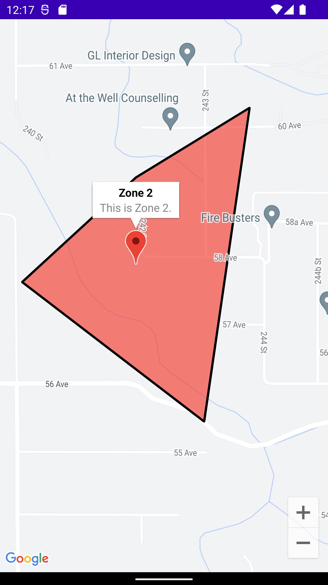

Example project using Android Google maps SDK on Android with Jetpack compose.

This has changed within the last year or so. Now there's a new [compose API for Google maps](https://github.com/googlemaps/android-maps-compose). Previously we had to use an `AndroidView`. Technically this new API (`GoogleMap`) still uses an `AndroidView` under the hood, but it's easier to work with.

# Features

## Permissions
Asking for `ACCESS_FINE_LOCATION` permission. This is required to show the users location on the map.
 
 

## Polygons with markers
Display polygons with markers.
 
 

## Your location
Display your location (if you've accepted the permission).
 
 
