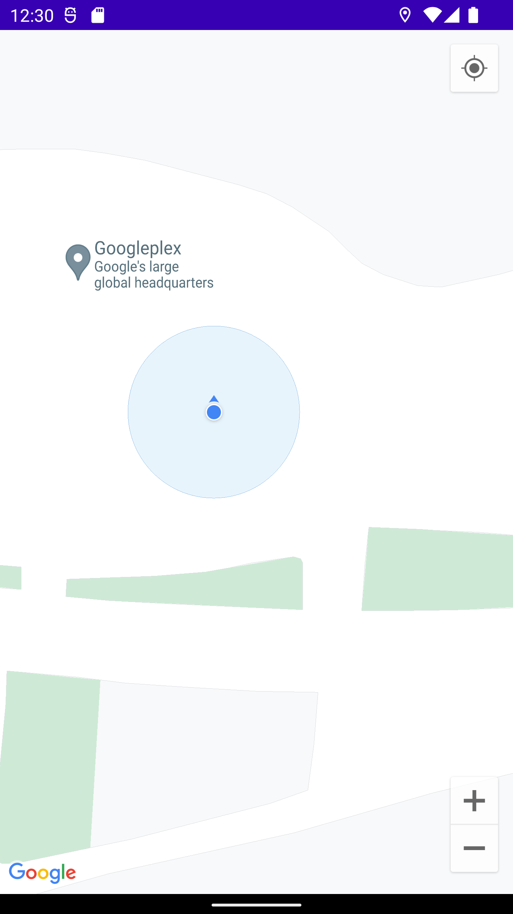

Example project using Android Google maps SDK on Android with Jetpack compose.

This has changed within the last year or so. Now there's a new [compose API for Google maps](https://github.com/googlemaps/android-maps-compose). Previously we had to use an `AndroidView`. Technically this new API (`GoogleMap`) still uses an `AndroidView` under the hood, but it's easier to work with.

There's also a new API that makes it easier to set up clustering. Building a `ClusterManager` requires a `GoogleMap` object. It's more easily accessible with the new `MapEffect` composable.

# Features

## Permissions
Asking for `ACCESS_FINE_LOCATION` permission. This is required to show the users location on the map.
<br>
<br>


## Polygons with markers
Display polygons with markers.
<br>
<br>


## Your location
Display your location (if you've accepted the permission).
<br>
<br>


# Google Maps SDK for Android Setup
1. You'll need a billing account. Create one here https://console.cloud.google.com/billing.
2. Create a new project in cloud console https://console.cloud.google.com/. Once its created switch to that project.
3. Go to marketplace and enable google maps SDK for the new project https://console.cloud.google.com/marketplace.
   - "Maps SDK for Android"
   - Enable billing through the billing account your created
4. Enable google maps in cloud console
   - Specify "Android apps" and generate a SHA1
5. Add the dependencies to your android project (listed below in "Dependencies" section).
   - **Note: it's a good idea to copy all the versions I used in this project so you can be sure everything will work.**
      - [build.gradle (project)](https://github.com/mitchtabian/Google-Maps-Compose/blob/master/build.gradle)
      - [build.gradle (app)](https://github.com/mitchtabian/Google-Maps-Compose/blob/master/app/build.gradle)
6. Add your API key to `local.properties`. **Note:** To reference the API key in `local.properties` you'll need the secrets plugin installed. See my [build.gradle (project)](https://github.com/mitchtabian/Google-Maps-Compose/blob/master/build.gradle). It's the `com.google.android.libraries.mapsplatform.secrets-gradle-plugin:secrets-gradle-plugin:2.0.1` dependency.
```
# local.properties
GOOGLE_MAPS_API_KEY=<YOUR_KEY>
```
7. Update your `AndroidManifest.xml` to include the API key. Within the `application` tag.
```
<application
   ...
   ... >
   <meta-data
	  android:name="com.google.android.geo.API_KEY"
	  android:value="${GOOGLE_MAPS_API_KEY}"/>
</application>
```
8. Add `ACCESS_FINE_LOCATION` and `ACCESS_COURSE_LOCATION` permissions to manifest. You'll need these if you want to access the users location.
```
<uses-permission android:name="android.permission.ACCESS_COARSE_LOCATION" />
<uses-permission android:name="android.permission.ACCESS_FINE_LOCATION"/>
```
9. If it's not working for you go watch the video I made on youtube. I might have forgot something in these steps. https://www.youtube.com/watch?v=hhSTYK7I78c


# Notes / Gotchas
1. You will need to enable billing on your google cloud console to complete this example. You won't be charged anything as long as you stay under the daily request limit. Then add your API key to `local.properties`.
```
GOOGLE_MAPS_API_KEY=<YOUR_KEY>
```
2. If the user declines the permission request twice they will need to manually enable the permission from system settings for the app (or uninstall and reinstall). That's a whole other topic - I'm just assuming they accept in this example.
3. Need `androidx.appcompat:appcompat` dependency for `MapEffect`. I was seeing an `AppCompatTextView` exception being thrown if I didn't include it.

# Dependencies
1. Google maps SDK for Android https://developers.google.com/maps/documentation/android-sdk/config
2. Utility library https://developers.google.com/maps/documentation/android-sdk/utility/setup
3. Maps android kotlin extensions https://developers.google.com/maps/documentation/android-sdk/ktx
    - note there is also a ktx version of the utility library listed above.
4. Google maps for compose library
    - https://github.com/googlemaps/android-maps-compose